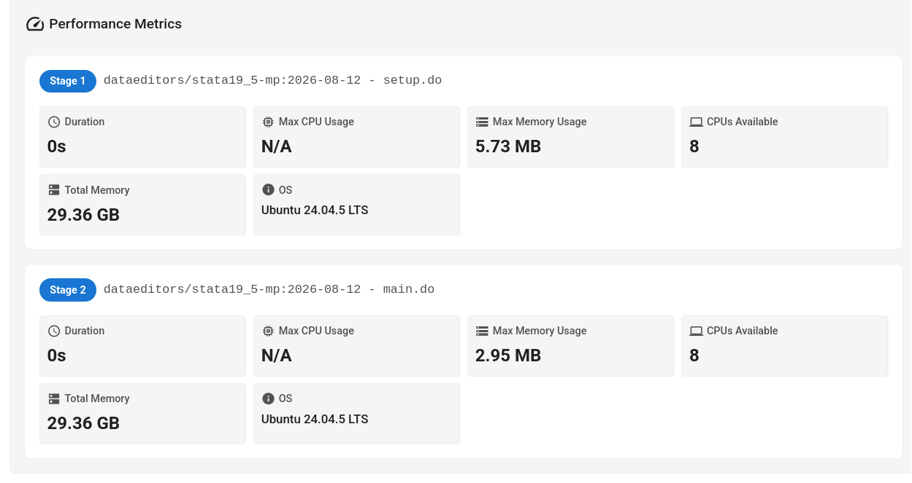
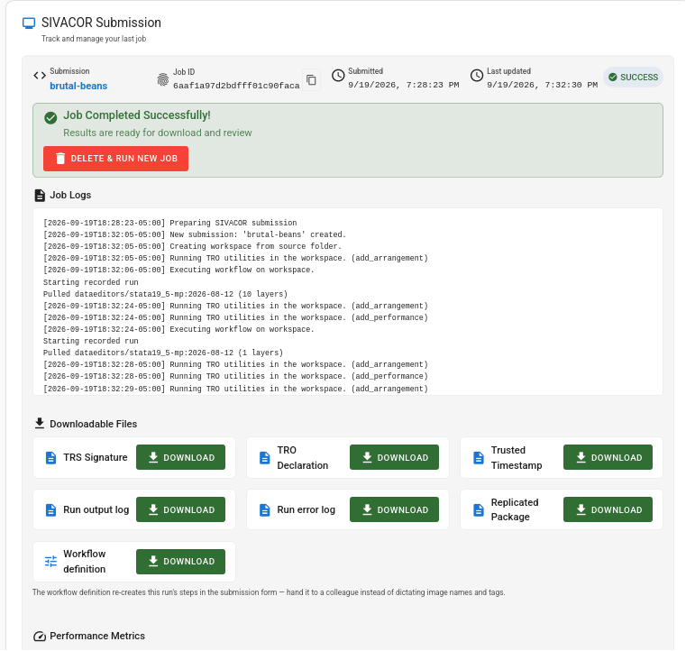

# Behind the scenes

What does SIVACOR do to ensure that the resulting replication package is **trusted**? 

## SIVACOR implements TRACE

SIVACOR is an example of a [TRACE-compliant system](https://transparency-certified.github.io/trace-specification/docs/elements/#element-trace-system). The resulting package 

- provides a snapshot of various processing stages, importantly, the first and last states of the processing system. 
- it runs the user's code in a documented and controlled fashion.
- if configured by the user, it will also disable network (internet) access, ensuring that all materials are within the system.
- it certifies that the replication package was run without user intervention - important for ensuring future reproducibility, when support by the authors may not be available.
- it cryptographically signs all the code, outputs, logs and metadata associated with the replication package, using a cryptographically secure time-stamp and the system maintainers' PGP keys, ensuring that any tampering with the package can be detected later.

## Example Log of a SIVACOR Submission

A summary of those activies shows up on the runtime view of the SIVACOR system:


:::{attention}
The system is actively developed, and the specific details may vary over time.
:::

## Preparing the system

:::{admonition}
:class: seealso

```
[2026-09-19T18:28:23-05:00] Preparing SIVACOR submission
[2026-09-19T18:32:05-05:00] New submission: 'brutal-beans' created.
```
:::

The computer system is configured to run the user's code. A compute node is requested.

## Unpacking the uploaded ZIP file

:::{admonition}
:class: seealso

```
[2026-09-19T18:32:05-05:00] Creating workspace from source folder.
```
:::

At this point, the uploaded archive is unpacked. 

## First snapshot

:::{admonition}
:class: seealso

```
[2026-09-19T18:32:05-05:00] Running TRO utilities in the workspace. (add_arrangement)
```
:::

An [arrangement](https://transparency-certified.github.io/trace-specification/docs/trov-vocabulary/#arrangements-and-locations) captures checksums, time stamps, and file path of all files in the workspace. This is the first one: it should correspond exactly to the unpacked archive.

## Setting up the software, and running the code.


:::{admonition}
:class: seealso

```
[2026-09-19T18:32:06-05:00] Executing workflow on workspace.
Starting recorded run
Pulled dataeditors/stata19_5-mp:2026-08-12 (10 layers)
```
:::

The various software components, as defined by the user on [Step 2](step2-choosing-image.md), are downloaded (`pulled`), here Stata. The user's script is then run. 

## Recording the state after running code


:::{admonition}
:class: seealso

```
[2026-09-19T18:32:24-05:00] Running TRO utilities in the workspace. (add_arrangement)
[2026-09-19T18:32:24-05:00] Running TRO utilities in the workspace. (add_performance)
```
:::

The [arrangement](https://transparency-certified.github.io/trace-specification/docs/trov-vocabulary/#arrangements-and-locations) after running the user's code is recorded, capturing any changes that occurred. The run of the user's code is a [performance](https://transparency-certified.github.io/trace-specification/docs/trov-vocabulary/#core-entities), and is separately recorded.

## Repeats for subsequent runs

When there are multiple steps to a workflow, this repeats for each step:

:::{admonition}
:class: seealso

```
[2026-09-19T18:32:24-05:00] Executing workflow on workspace.
Starting recorded run
Pulled dataeditors/stata19_5-mp:2026-08-12 (1 layers)
[2026-09-19T18:32:28-05:00] Running TRO utilities in the workspace. (add_arrangement)
[2026-09-19T18:32:28-05:00] Running TRO utilities in the workspace. (add_performance)
```
:::

In this example, there were two steps, which are also displayed for the user at the end of the process:



## Cleaning up

Since every job can also remove files, via the [`.sivacorignore`](excluding-files-from-final-package) mechanism, the last step is another arrangement, capturing the final state of the workspace.

:::{admonition}
:class: seealso

```
[2026-09-19T18:32:29-05:00] Running TRO utilities in the workspace. (add_arrangement)
[2026-09-19T18:32:29-05:00] Running TRO utilities in the workspace. (prune_performance)
```
:::

## Wrapping the package: signing

To ensure the integrity and authenticity of the replication package, it is [signed](https://transparency-certified.github.io/trace-specification/docs/tro-declaration-format/#signing-and-timestamping):

:::{admonition}
:class: seealso

```
[2026-09-19T18:32:29-05:00] Running TRO utilities in the workspace. (sign)
```
:::

Different TRACE implementations can use different signing mechanisms. SIVACOR uses PGP, the key can be found on the [Signing key](keys.md) page.

## Returning the package to the user

The finalized package is made available to the user again

:::{admonition}
:class: seealso

```
[2026-09-19T18:32:30-05:00] Uploading executed replication package to Girder.
```
:::

which then appears to the user as:

