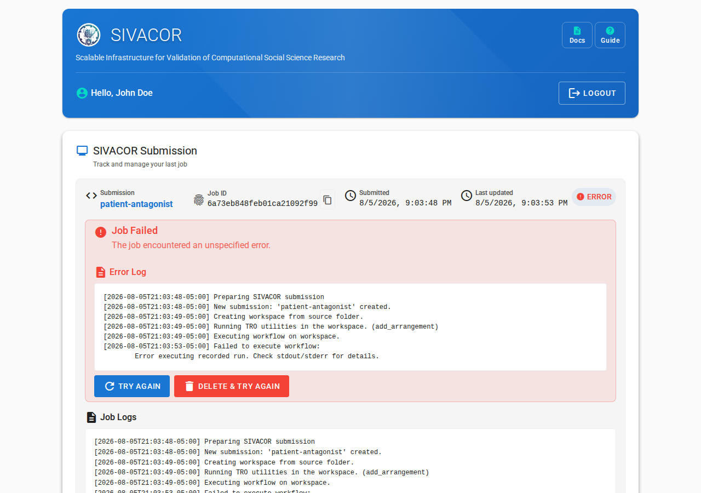

# FAQ

## What kind of files can I upload?

Currently, anything that the [Python `zipfile`](https://docs.python.org/3/library/zipfile.html) or [Python `tarfile`](https://docs.python.org/3/library/tarfile.html) functions can handle. Generically, this means

- ZIP files (`.zip`)
- TAR files (`.tar`, `.tar.gz`, `.tgz`, `.tar.bz2`, `.tar.xz`)

If you need a particular format, feel free to reach out to us.

## How does this run my code?

::::{tab-set}

:::{tab-item} R

For R, the system first tries to identify the working directory that R should be run from. The system searches for `renv.lock`, and uses that directory as the working directory. Failing that, it defines the path to `(MAIN_FILE)`  as the working directory. It then runs

```
cd (WORKING_DIRECTORY)
/usr/local/bin/R --no-save --no-restore -f (MAIN_FILE)
```

:::

:::{tab-item} Stata

For Stata, the system always assumes that the directory containing the `(MAIN_FILE)` is the working directory. It then runs

```
cd (WORKING_DIRECTORY)
/usr/local/bin/stata-mp -b do (MAIN_FILE)

```
:::

:::{tab-item} MATLAB
For MATLAB, the system always assumes that the directory containing the `(MAIN_FILE)` is the working directory. It then runs

```
cd (WORKING_DIRECTORY)
/usr/local/bin/matlab -batch "(MAIN_FILE_WITHOUT_.M_EXTENSION)"
```

Stripping `.m` is done automatically, you should not omit it from your main file name.

:::
::::

## How do I know a job failed?

When a job fails to run, you will see a notice in the job status page:



You should inspect the `Run output log` and `Run error log` files to see what went wrong. When a job fails, no `Replicated Package` is produced.

You might want to consult the [debugging hints](debugging.md) for tips.

## My job used to work, and now it runs out of memory

SIVACOR now runs every submission on a machine created for that submission alone, with
**16 cores and about 56.8 GiB of usable RAM** (see [System Description](system.md)).
Earlier in the pilot, submissions ran on a larger shared server, so an analysis that only
just fitted before may now exceed the available memory.

The job log names the limit your run was given, and the exact figure is in the run's
performance data — quote that rather than the approximation above when you get in touch.

If your analysis genuinely needs more than this, please contact us — do not spend a long time
trying to shrink it first.

## My job failed saying it ran out of disk space

The error looks like this:

> Ran out of disk space: 4.7 GiB free on the workspace filesystem, below the 5.0 GiB floor.

The machine running your submission has 60 GB of disk, and that space is shared between your
replication package (including everything your code writes) and the software image it runs
in. Large images consume a substantial part of it — see the
[size considerations table](step0-prepare.md#size-considerations) for how much room typical
images leave free.

Things that help:

- exclude large intermediate or raw data files with
  [`.sivacorignore`](step0-prepare.md#excluding-files-from-final-package) — note this affects
  the final package, not what your code writes while running
- delete intermediate files in your own code once you no longer need them
- check that your code is not writing very large log or temporary files unintentionally

If your analysis legitimately needs more room, please contact us.

## My job failed with "Submission abandoned"

The message looks like one of these:

> Submission abandoned: no sign of life for 0:31:07; the worker running it is presumed lost.

> Submission abandoned: exceeded the maximum runtime of 7 days, 0:00:00; started at ...

The first means the machine running your submission was lost. That is an infrastructure
problem rather than a problem with your code — just submit the package again, and contact us
if it keeps happening.

The second means your run hit the 7 day limit. If your analysis genuinely needs longer,
contact us before resubmitting.

## What are all these output files?

SIVACOR produces six output files, plus a workflow definition:


- A **replicated package** as a ZIP file. This contains all the original files, and the output files generated by SIVACOR.

- A **run output log** and a **run error log**. Ideally the latter is an empty file, but it contains all the error messages the software may have produced. For packages like Stata, these are more likely included in the **run output log**. 

A few [TRACE-related](https://transparency-certified.github.io/) files are produced that can be used by others to verify that the files (figures, tables) were truly produced by this system.

- A **TRO Declaration** file. It describes the various states of the process, and describes the files present at each step. On SIVACOR, this is relatively straightforward, but it can grow more complicated.
- A **TRS Signature** file. This is a text file that contains a cryptographic signature of the results, which can be used to verify that the results have not been altered.
- A **trusted timestamp** file. This file contains a timestamp that is certified by a trusted time server, used in the signing process.

These three files are also included in the `tro` folder inside the replication package.

- A **workflow definition**, a small YAML file recording the software, versions and main
  files this run used. It is not part of the signed package, and is not evidence of
  anything — it is a convenience, so the same configuration can be re-created later by
  importing it on the submission page. It never contains any secrets you supplied.

## What can I do with the TRO files? How can I check the package?

There are two levels of verification possible:

- whether the **TRO Declaration** has been modified.
- whether some or all of the arrangements correspond to the files you downloaded.

Both of these checks can be done with the Python [`tro-utils`](https://github.com/transparency-certified/tro-utils) package. 

::::{admonition} Installing `tro-utils`
:class: tip dropdown

You can install `tro-utils` via `pip`:

```bash
pip install tro-utils
```

or 

```bash
pipx install tro-utils
```

::::

::::{admonition} Verifying the integrity of the TRO Declaration
:class: tip dropdown

You can verify that the TRO Declaration has not been modified since it was signed by running:

```bash
tro-utils verify-timestamp /path/to/tro/(UUID).jsonld 
```

which might yield something like this:

```bash
> tro-utils verify-timestamp tro/tro-696d3b46adffb76fef0d83bc.jsonld 
Using configuration from /etc/ssl/openssl.cnf
Warning: certificate from '/tmp/tmpuw0g59lb' with subject '/O=Free TSA/OU=TSA/description=This certificate digitally signs documents and time stamp requests made using the freetsa.org online services/CN=www.freetsa.org/emailAddress=busilezas@gmail.com/L=Wuerzburg/C=DE/ST=Bayern' is not a CA cert
Verification: OK
```

It is OK to ignore the warning, the important part is the `Verification: OK` line.


::::

::::{admonition} Verifying the arrangements
:class: tip dropdown

You can verify that the arrangements in the TRO Declaration correspond to the files you downloaded by running:

```bash
tro-utils verify-package path/to/tro/(UUID).jsonld path/to/files
```

For instance, in the standard SIVACOR download, the following will generically work

```bash
> tro-utils verify-package tro/tro-\*.jsonld project/
```

yielding

```bash
Verifying that arrangement 'arrangement/0' matches package contents of 'project/' ✗
Verifying that arrangement 'arrangement/1' matches package contents of 'project/' ✓
```

This indicates that there are two arrangements (`0` and `1`) recorded in the package, but only arrangement `1` matches the files in the `project/` folder, presumably because some files were either modified, added, or deleted from arrangement `0`. In the context of SIVACOR, arrangement `0` are the files you uploaded.

::::


## It's failing on a file, but the file is there!

Actually, the file may not be called exactly the same thing. The containers used by SIVACOR are based on Linux, and Linux uses a case-sensitive file system. So if your main file is called `Main.do`, or `Main.DO`, that is not the same as `main.do`. The same applies for any files written or read by Stata or R: Reading from `data/raw/gs4.csv` is not the same as reading from `data/Raw/GS4.csv`. 

## What do I set my working directory to for this to work?

We often hear from authors

> The person who wants to replicate our files has to set their own path. 

and see code like

```stata
cd "C:\Users\username\Documents\project"
```

or 

```r
setwd("C:/Users/username/Documents/project")
```

You must avoid this for SIVACOR to work. You should use relative paths throughout, and if setting a path, do it once, dynamically. 

:::::{tab-set}

::::{tab-item} Stata

You can set the working directory to the directory of the main do-file by including this code at the top of your main do-file:

```stata
global rootdir : pwd
```

and then either

```stata
cd "$rootdir"
use "data/mydata.dta", clear
save "output/results.dta", replace
```

or (better) use fully-qualified full paths that use `$rootdir`, e.g.,

```stata
use "$rootdir/data/mydata.dta", clear
save "$rootdir/output/results.dta", replace
```

**References**

- <https://larsvilhuber.github.io/self-checking-reproducibility/02-hands_off_running.html#creating-a-main-or-master-script>
- 

::::

::::{tab-item} R

In R, you should use one of several options to set the working directory dynamically. For instance, you can use the `here` package:

```r
library(here)
setwd(here::here())
```

which will look for certain files (like `.here`) to determine the project root. Alternatively, you can use the `rprojroot` package:

```r
library(rprojroot)
setwd(rprojroot::find_root(rprojroot::is_rstudio_project))
```

Better: use fully qualified paths downstream from the definition of a `rootdir` variable:

```r
rootdir <- here::here()
# alternatively:
# rootdir <- rprojroot::find_root(rprojroot::is_rstudio_project())
data <- read.csv(file.path(rootdir, "data", "mydata.csv"))
write.csv(results, file.path(rootdir, "output", "results.csv"))
```

:::{warning}
Avoid using `rstudioapi::getActiveProject()` as this requires RStudio to be running. SIVACOR runs R in a terminal, not in RStudio.
:::

**References**

- <https://here.r-lib.org/>
- <https://rprojroot.r-lib.org/>

::::

:::::


## Stata errors

### `r(601)`

This is a file-not found error. There are two reasons for this:

- you did not include the file in your uploaded package
- you included a file that is similarly named, but has different capitalization. Ensure that your code uses naming that matches exactly the files you included, including upper/lower case.

## R errors

### `rJava`

Due to the way the containers are set up, it is currently not possible to use Java-related packages. The typical error message will be

```
Error: package or namespace load failed for ‘rJava’:
 .onLoad failed in loadNamespace() for 'rJava', details:
  call: dyn.load(file, DLLpath = DLLpath, ...)
  error: unable to load shared object '/tmp/workspace-6964fac0d696fbdb1d66ce2c/R/library/rJava/libs/rJava.so':
  libjvm.so: cannot open shared object file: No such file or directory
```

Issue: <https://github.com/SIVACOR/sivacor-repo-choice/issues/3>

## What do I do with the replicated package that I can download?

You can upload it directly to the journal submission system! For instance, in the case of the American Economic Association, simply **import** the ZIP file into the AEA's [Data and Code Repository](https://www.icpsr.umich.edu/sites/aea/home) (see [instructions](https://aeadataeditor.github.io/aea-de-guidance/)).

## How do I delete files on SIVACOR?

SIVACOR only temporarily retains any files that you upload. You can delete files immediately (after success or failure) by clicking the **Delete & Run New Job** button on the job status page:


## The system appears to be down.

SIVACOR runs on [Jetstream 2](https://jetstream-cloud.org/). If Jetstream 2 is down for maintenance, SIVACOR will be down as well. You can check the [Jetstream 2 status page](https://jetstream.status.io/) for any ongoing maintenance or issues.

If JetStream 2 is operational, but SIVACOR appears down, please contact us via the button at the top of this page.

## My submission has been "Waiting for a worker" for a long time

SIVACOR starts a machine for each submission, which normally takes two to three minutes,
followed by the download of the software image. If other users' submissions are occupying
the machines available to the pilot, yours waits until one frees up.

A wait of several minutes is normal, especially for MATLAB. If a submission stays in this
state for much longer than that, please contact us and include the Job ID shown on the
page — there is a copy button next to it.
