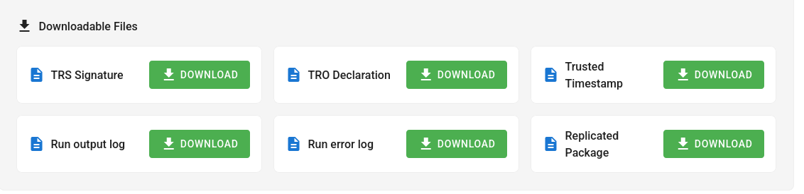

# FAQ

## What kind of files can I upload?

Currently, anything that the [Python `zipfile`](https://docs.python.org/3/library/zipfile.html) or [Python `tarfile`](https://docs.python.org/3/library/tarfile.html) functions can handle. Generically, this means

- ZIP files (`.zip`)
- TAR files (`.tar`, `.tar.gz`, `.tgz`, `.tar.bz2`, `.tar.xz`)

If you need a particular format, feel free to reach out to us.

## How does this run my code?

For R, the system runs

```
/usr/local/bin/R --no-save --no-restore -f (MAIN_FILE)
```

For Stata, the system runs

```
/usr/local/bin/stata-mp -b do (MAIN_FILE)

```

## How do I know a job failed?

When a job fails to run, you will see a notice in the job status page:


You should inspect the `Run output log` and `Run error log` files to see what went wrong. When a job fails, no `Replicated Package` is produced.

## What are all these output files?

SIVACOR produces six output files:



- A **replicated package** as a ZIP file. This contains all the original files, and the output files generated by SIVACOR.

- A **run output log** and a **run error log**. Ideally the latter is an empty file, but it contains all the error messages the software may have produced. For packages like Stata, these are more likely included in the **run output log**. 

A few [TRACE-related](https://transparency-certified.github.io/) files are produced that can be used by others to verify that the files (figures, tables) were truly produced by this system.

- A **TRO Declaration** file. It describes the various states of the process, and describes the files present at each step. On SIVACOR, this is relatively straightforward, but it can grow more complicated.
- A **TRS Signature** file. This is a text file that contains a cryptographic signature of the results, which can be used to verify that the results have not been altered.
- A **trusted timestamp** file. This file contains a timestamp that is certified by a trusted time server, used in the signing process.

These three files are also included in the `tro` folder inside the replication package.

## It's failing on a file, but the file is there!

Actually, the file may not be called exactly the same thing. The containers used by SIVACOR are based on Linux, and Linux uses a case-sensitive file system. So if your main file is called `Main.do`, or `Main.DO`, that is not the same as `main.do`. The same applies for any files written or read by Stata or R: Reading from `data/raw/gs4.csv` is not the same as reading from `data/Raw/GS4.csv`. 

## What do I set my working directory to for this to work?

We often hear from authors

> The person who wants to replicate our files has to set their own path. 

and see code like

```stata
cd "C:\Users\username\Documents\project"
```

or 

```r
setwd("C:/Users/username/Documents/project")
```

You must avoid this for SIVACOR to work. You should use relative paths throughout, and if setting a path, do it once, dynamically. 

:::::{tab-set}

::::{tab-item} Stata

You can set the working directory to the directory of the main do-file by including this code at the top of your main do-file:

```stata
global rootdir : pwd
```

and then either

```stata
cd "$rootdir"
use "data/mydata.dta", clear
save "output/results.dta", replace
```

or (better) use fully-qualified full paths that use `$rootdir`, e.g.,

```stata
use "$rootdir/data/mydata.dta", clear
save "$rootdir/output/results.dta", replace
```

**References**

- <https://larsvilhuber.github.io/self-checking-reproducibility/02-hands_off_running.html#creating-a-main-or-master-script>
- 

::::

::::{tab-item} R

In R, you should use one of several options to set the working directory dynamically. For instance, you can use the `here` package:

```r
library(here)
setwd(here::here())
```

which will look for certain files (like `.here`) to determine the project root. Alternatively, you can use the `rprojroot` package:

```r
library(rprojroot)
setwd(rprojroot::find_root(rprojroot::is_rstudio_project))
```

Better: use fully qualified paths downstream from the definition of a `rootdir` variable:

```r
rootdir <- here::here()
# alternatively:
# rootdir <- rprojroot::find_root(rprojroot::is_rstudio_project())
data <- read.csv(file.path(rootdir, "data", "mydata.csv"))
write.csv(results, file.path(rootdir, "output", "results.csv"))
```

:::{warning}
Avoid using `rstudioapi::getActiveProject()` as this requires RStudio to be running. SIVACOR runs R in a terminal, not in RStudio.
:::

**References**

- <https://here.r-lib.org/>
- <https://rprojroot.r-lib.org/>

::::

:::::


## Stata errors

### `r(601)`

This is a file-not found error. There are two reasons for this:

- you did not include the file in your uploaded package
- you included a file that is similarly named, but has different capitalization. Ensure that your code uses naming that matches exactly the files you included, including upper/lower case.


## What do I do with the replicated package that I can download?

You can upload it directly to the journal submission system! For instance, in the case of the American Economic Association, simply **import** the ZIP file into the AEA's [Data and Code Repository](https://www.icpsr.umich.edu/sites/aea/home) (see [instructions](https://aeadataeditor.github.io/aea-de-guidance/)).


