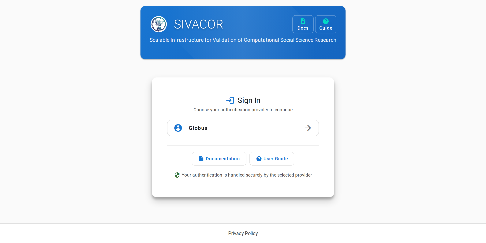
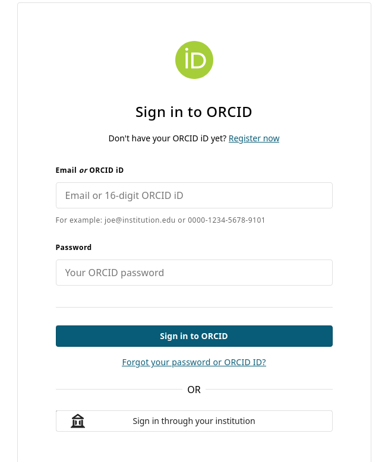
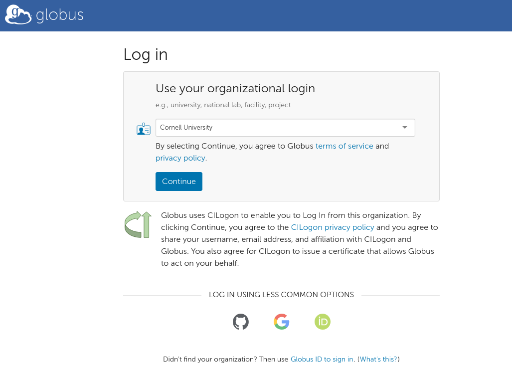
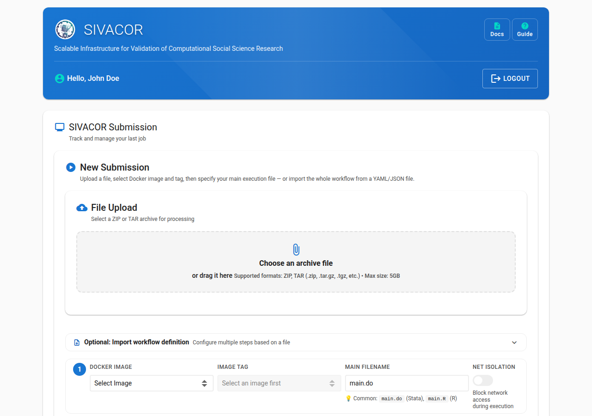
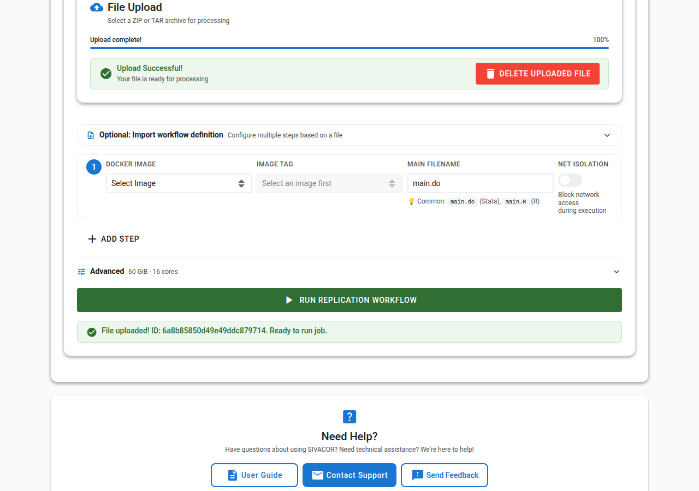

# Uploading Packages to SIVACOR

## Logging In

The main submission site is <https://submit.sivacor.org>.

SIVACOR uses institutional logins via [Globus](https://globus.org/) or [ORCID](https://orcid.org). 
You can choose one or the other.

::::{tab-set}

:::{tab-item} ORCID Login

Click on the "Login with ORCID" button. You will be redirected to the ORCID login page. After entering your ORCID credentials, you will be redirected back to SIVACOR. You can also use your institutional login here, if known to ORCID.

:::

:::{tab-item} Globus Login

Click on the "Login with Globus" button. You can search for your institution, or use one of the other login methods. You will be redirected to your institution's login page. After entering your credentials, you will be redirected back to SIVACOR.

:::
::::

## Uploading a Package

Once logged in, you will see the upload page.

Upload the replication package (`ZIP` or `tar.gz` files). 

