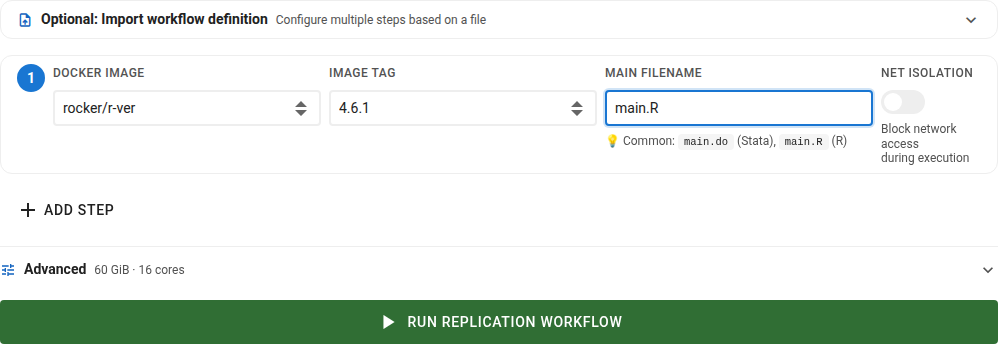
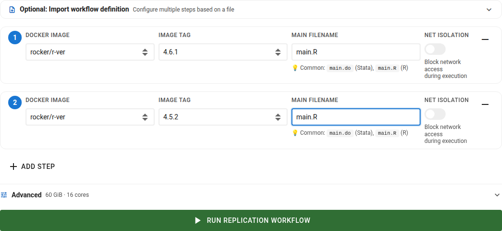

# Choosing Software and Running Jobs

If the upload was successful, scroll down.

## Choose software and version

Choose first the software and version from the curated list (see [container images](images.md)). You can also select an image tag (sub version), but generally, the latest version should work. 

:::{tip}

If you need a different image, please contact us.

:::

## Identify the main file

Finally, identify the name of the main file. This is the file that will be executed by SIVACOR. For `R`, this is typically an `R` script (`.R` file). For `Stata`, this is typically a `do` file (`.do` file). 

:::{warning}

Please be sure to use the proper case (`main.do` is not the same as `Main.do`) and include the extension.

:::

## Chained runs (steps)

You can chain multiple runs together, by selecting the `+ ADD STEP` button. The runs will be run in separate containers, but the output of one run will be made available as input to the next run.

:::{note}

SIVACOR is currently in a pilot phase. As such, the system is limited 

- to running with a maximum of 28GB of RAM on an 8-core AMD EPYC-Milan Processor

There is at present no runtime limit.

:::

## Submitting jobs

Then click on the `Run with...` button.

