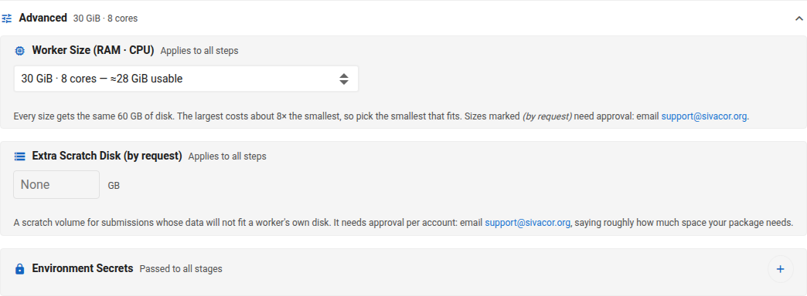
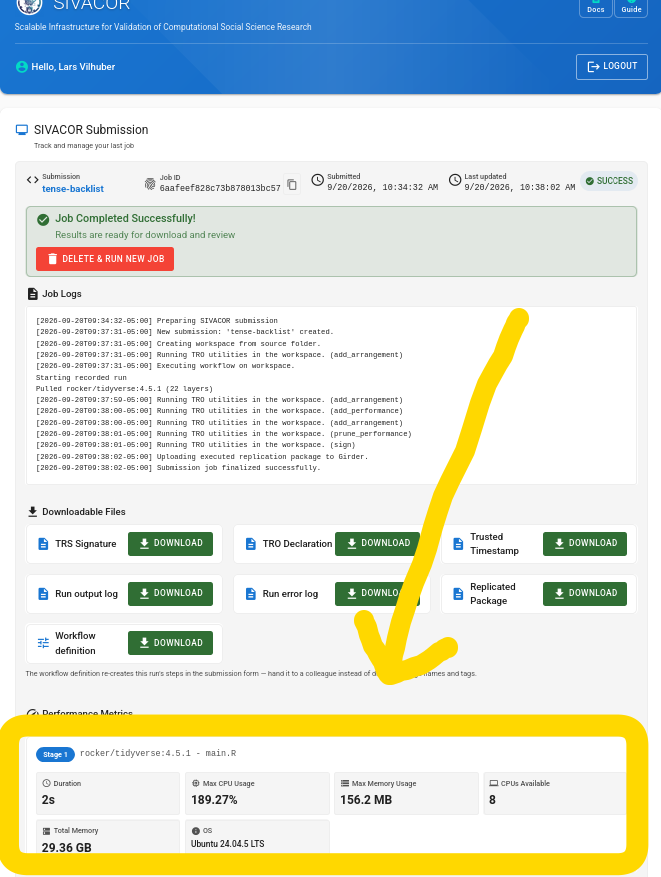
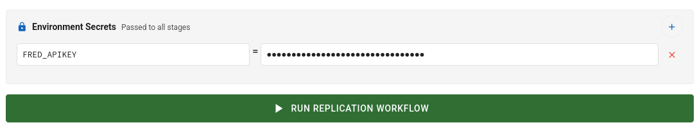

---
kernelspec:
  display_name: Python 3
  language: python
  name: python3
---

# Choosing Software and Running Jobs

```{code-cell} python
:tags: ["remove-input", "remove-output"]

import csv
from pathlib import Path

from IPython.display import HTML

nodes = list(csv.DictReader(Path("_data/jetstream2-nodes.csv").open()))
disk_gb = next(n for n in nodes if n["default"] == "true")["disk_gb"]

L, R = 'style="text-align:left"', 'style="text-align:right"'
table = (
    "<table>\n<thead><tr>"
    f"<th {L}>Size</th><th {R}>Cores</th><th {R}>Available to your analysis</th>"
    f"<th {R}>Disk</th><th {L}>Relative cost</th></tr></thead>\n<tbody>\n"
)
for n in nodes:
    cost = f"{n['relative_cost']}×" + (" — by request" if n["by_request"] == "true" else "")
    table += (
        f"<tr><td {L}>{n['memory_gib']} GiB</td><td {R}>{n['cores']}</td>"
        f"<td {R}>≈{n['memory_available_gib']} GiB</td><td {R}>{n['disk_gb']} GB</td>"
        f"<td {L}>{cost}</td></tr>\n"
    )
table += "</tbody>\n</table>"
size_table = HTML(table)
```

If the upload was successful, scroll down.


## Choose software and version

Choose first the software and version from the curated list (see [container images](images.md)). You can also select an image tag (sub version), but generally, the latest version should work. 

:::{attention}

If you need a different image, please contact us.

:::

## Identify the main file

Identify the name of the main file. This is the file that will be executed by SIVACOR. Include the extension (`.R`, `.do`,  `.jl`).

:::{warning}

Please be sure to use the proper case (`main.do` is not the same as `Main.do`) and include the extension.

:::

The file does not have to sit at the top of your package: SIVACOR searches the whole package for
that name, and runs it from the directory it was found in.

:::{warning}

For the same reason, the name must be **unique within the package**. If `main.R` exists in both
`code/` and `code/archive/`, SIVACOR cannot tell which one you meant and the run fails before it
starts, listing every copy it found. Rename or remove the extra copies in the archive you upload.

`.sivacorignore` does **not** help here: it is applied after your code has run, to decide what
goes into the final package, so an ignored file is still present and still ambiguous when the main
file is resolved.

:::

:::{tip}

 If your code needs packages, we suggest adding a setup step as the first part, and using a separate setup script, see [Step 0](#dependencies). Setup scripts typically require the network to be enabled, thus [**network isolation**](#network-isolation) should be disabled *for that step* — and left on for the analysis step that follows.

:::

:::{hint} About alternate extensions
:class: dropdown

Some software have multiple ways they can be invoked. For instance, you might use a RMarkdown file (`.Rmd`) instead of a plain R script (`.R`), or a Jupyter notebook (`.ipynb`) instead of a plain script. SIVACOR executes code using methods defined for each software, **not by extension**: an R image always runs your main file through R, a Stata image always through Stata. Naming a `.Rmd` or an `.ipynb` as the main file therefore does not work on its own — you need a **wrapper script**, in the image's own language, that your main file points to.

To render an RMarkdown document, the main file would be an ordinary `.R` script:

```{code} R
:filename: main.R
# Render RMarkdown
# Assert that rmarkdown is available
if (!requireNamespace("rmarkdown", quietly = TRUE)) {
  stop("rmarkdown package is required but not installed")
}
rmarkdown::render("main.Rmd")
``` 

A Jupyter notebook can be driven the same way, from a script in whichever of the supported languages the notebook's kernel uses.

Note also that many of these "fancier" methods require numerous additional packages just to handle the wrapper. For instance, to render a Jupyter notebook, 31 additional packages must be installed solely to render it. For RMarkdown, 12 additional packages are necessary.

:::

(network-isolation)=
## Network isolation

Each step carries a **Net Isolation** toggle, beside that step's image and main file. It is
**off by default**, and it is per step, not per submission: one step may be isolated and the next
not.

When it is on, the container has **no network access at all** for the whole of that step. Nothing
can be downloaded, no API can be called, and no result can depend on something fetched at run time.

:::{important}

**Isolation is part of what the signature certifies.** A step run with Net Isolation on records an
`InternetIsolation` attribute in the signed TRO declaration — evidence to a data editor that the
result could not have come from anywhere but the materials you uploaded. A step run without it
records no such attribute, and nothing in the certificate claims otherwise.

:::

This is the reason to split dependency installation into its own step. Install packages in a first
step with isolation **off**, then run the analysis in a second step with isolation **on**: the
analysis — the part being certified — is then isolated, even though the package downloads were not.
See [Step 0](step0-prepare.md#dependencies).

(chained-runs-steps)=
## Optional chained runs (steps)

You can chain multiple runs together, by selecting the `+ ADD STEP` button. The runs will be run in separate containers. Each run inherits the workspace modified by the previous run, so the output of one run will be made available as input to the next run.


:::{admonition} Advanced configuration of steps
:class: seealso dropdown

If you need to repeatedly run similar jobs on SIVACOR, you can describe the steps in a file
and import it instead of filling in the form. Expand **Optional: Import workflow definition**
at the top of the submission form, then choose or drag in a `YAML` or `JSON` file (any file
name, up to 256 KB). The file is checked before anything is filled in, and you will be told
which step is at fault if something is wrong — for example if an image or tag is not one of
the [curated images](images.md).

Importing replaces whatever is currently in the form, so you can always review and adjust
the steps before running.

A finished run offers the matching `Workflow definition` download, so the easiest way to get
a valid file is to run once, download it, and reuse it afterwards.

Expected configuration:

```yaml
stages:
  - image_name: dataeditors/stata15
    image_tag: "2023-01-27"
    main_file: main_step1.do
    network_isolation: true
  - image_name: rocker/tidyverse
    image_tag: "4.6.1"
    main_file: main_step2.R
    network_isolation: false
env_secrets:
  - key: API_TOKEN
    value: s3cret
```

`image_name`, `image_tag` and `main_file` are required for every step;
`network_isolation`, `env_secrets` and `resources` are optional. A file with no `resources`
block leaves the [machine size](#worker-size) as chosen on the form:

```yaml
resources:
  memory_gb: 60
stages:
  - image_name: rocker/tidyverse
    image_tag: "4.6.1"
    main_file: main.R
```

`memory_gb` must be one of the sizes in the [machine size](#worker-size) table. A file naming a size that is no longer
offered is refused rather than quietly run on a different machine, and the message names the sizes
that are available.

`resources` may also carry `disk_gb`, for [extra scratch disk](#scratch-disk) — but only if your own
account has an allowance for it. A downloaded `Workflow definition` carries the figure the run was
granted, so a file that came from somebody else may ask for more than you can have; the import is
then refused and names your limit. A run that used no extra disk has no `disk_gb` line at all.

:::{danger}

Secrets imported from a file are placed in the form and sent with the submission, but they are never stored in your browser, and they are never included in a downloaded `Workflow definition`. If you share a workflow file that you wrote by hand, remember to remove any `env_secrets` from it first.

:::


(advanced-settings)=
## Advanced settings

Several advanced parameters are in a dropdown menu. 




:::{important}

Each setting applies to the **whole** submission.

:::

- [**Worker Size**](#worker-size): the type of machine your submission runs on
- [**Extra Scratch Disk**](#scratch-disk): a temporary disk in addition to the machine's own disk space
- [**Environment Secrets**](#environment-secrets): values passed to your code as environment variables. 


(worker-size)=
### Choose the machine size

Under **Advanced**, **Worker Size** sets the machine your submission runs on. It applies to the
whole submission: every step runs on the same machine.

```{code-cell} python
:tags: ["remove-input"]

size_table
```

**Submissions default to the smallest size.** Only request more if you know that you need more. The output from a run shows what your last run
actually used, as a share of what it was allowed.

:::{admonition} Where to find run statistics
:class: dropdown hint

A finished run reports its **peak memory** and **peak disk** use on the submission page, beside
the download links, as a share of what the machine allowed. Those two figures are what to size the
*next* run on: a run that peaked at 40 % of a 30 GiB machine has no reason to ask for 60 GiB.


:::

:::{important}

Important points to consider:

- **Disk does not grow with the size.** Every size has the same {eval}`disk_gb` GB primary disk, shared between your package
  and the software image. If you have run out of *disk*, a bigger machine will not help: ask for
  [extra scratch disk](#scratch-disk) instead. See
  [Step 0](step0-prepare.md#size-considerations).
- **Cores and memory are tied, not chosen separately.** 
- **The usable disk and memory size is always lower than the  name suggests.** A small amount is reserved for the operating system itself. 
- The two **largest sizes are not selectable** by default. They must be requested, see **Requesting additional resources**.
:::


(scratch-disk)=
### Extra scratch disk

**Extra Scratch Disk** asks for a temporary disk *in addition to* the machine's primary {eval}`disk_gb` GB disk. It is enabled only upon request, see **Requesting additional resources**.

Once your account has a scratch disk allowance:

- enter the number of gigabytes you want for **this** submission, up to your allowance. Requests are rounded **up** to the nearest 10 GB;
- **no changes are needed** for your analysis. Your code sees a single filesystem. 
- the requested number is not preserved from one run to the next - it must be re-entered every time you submit a job.

:::{important}

- **This is disk, not memory.** If a run was stopped for using too much *memory*, pick a larger [machine size](#worker-size) instead.
- **Ask for what you need, not the maximum.** The space comes from a shared pool, and is in competition with any other submissions. If you request a large amount, other submissions asking for space may have to
  wait. 


:::

### Requesting additional resources

To request additional resources, send an email to [support@sivacor.org](mailto:support@sivacor.org). 

:::{admonition} Information requested
:class: dropdown seealso

SIVACOR uses a limited allocation of compute resources. The largest machine sizes cost the project four and eight times the smallest, and additional volumes are similarly limited. We review requests sent to [support@sivacor.org](mailto:support@sivacor.org). Please  say what you are running and why it needs the additional resources. Once your account is authorized to use the larger machine sizes, they become selectable. If authorized to use additional volumes, the field becomes editable.

:::

(environment-secrets)=
### Environment variables

You can set environment variables for your job by using the `env_secrets` block in a workflow definition file, or by entering them in the submission form. These variables are available to your code during execution.




:::{admonition} Workflow YAML Example
:class: dropdown tip

```yaml
env_secrets:
  - key: API_TOKEN
    value: s3cret
```

:::

## Submitting jobs

Then click on the `Run Replication Workflow` button.


:::{hint}
If the button is greyed out, the upload has not finished, or the uploaded file was deleted. The
button says which. See [Step 1](step1-upload.md).
:::


## ℹ️ FAQ

See the [FAQ](faq.md#choosing-software-and-running-jobs).
