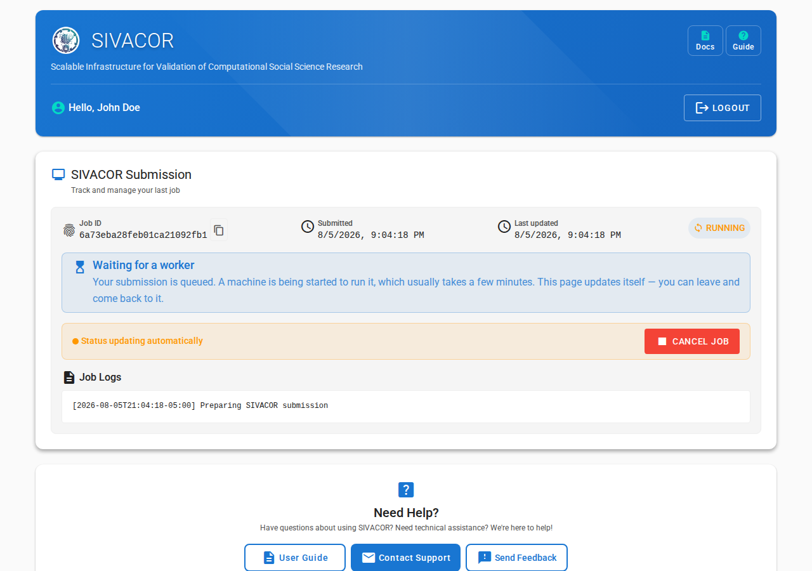

#  Monitoring Job Status

:::{caution}

You can only run one job at a time. If you have an ongoing job, you will not be able to submit a new one.

:::

Every time you come back to the page, you will see the status of your job.

You will also be notified by email when your job starts, and when it ends.

## Waiting for a machine

SIVACOR starts a machine for your submission alone, so there is normally a short wait
before anything appears to happen. While that is going on, you will see a
**Waiting for a worker** message.

Starting the machine usually takes **2 to 3 minutes**. The software image then has to be
downloaded onto it, which is quick for Stata and R, but can add a couple of minutes for the
much larger MATLAB / Dynare image. So it is normal for several minutes to pass before the
first output appears.

At busy times, when other users' submissions are occupying the available machines, your
submission may wait longer before it starts.

:::{tip}

You do not have to keep the page open. The page updates itself, and you can leave and come
back to it — your submission keeps running, and you will be emailed when it ends.

:::

## If you already have a submission in progress

If you try to submit while an earlier submission is still running, SIVACOR refuses the new
one and tells you which submission is blocking it:

> You already have a submission in progress ('...'). Please wait for it to finish, or
> cancel it, before submitting a new one.

The message includes a **Go to your submission in progress** link that takes you to the
submission that is still running. From there you can either wait for it to finish, or use
**Cancel Job** to stop it — once it is cancelled you can submit a new one.

## If a job fails unexpectedly

Occasionally the machine running a submission is lost. When that happens, SIVACOR marks the
submission as failed with a message like:

> Submission abandoned: no sign of life for 0:31:07; the worker running it is presumed lost.

You will receive the usual failure email. This is an infrastructure problem, not a problem
with your code: simply submit the package again. If it keeps happening, please contact us.
