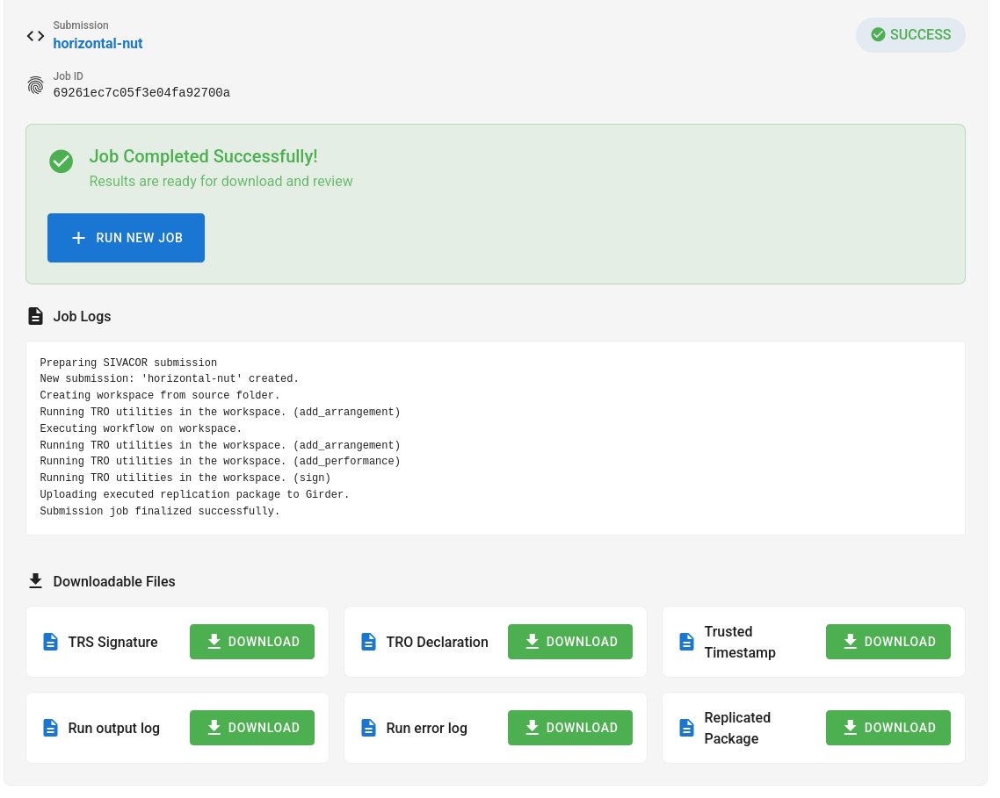
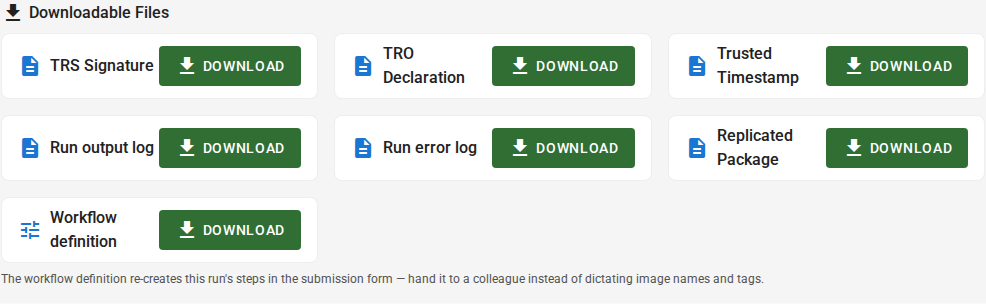

# Downloading Results

Once the job is finished, you will see the following page:

You can now download the `Replicated Package`, a ZIP file that contains your originally submitted materials, the output files generated by your code, and the TRACE-related files (TRO Declaration, TRS Signature, Trusted Timestamp) that prove that this job was run on SIVACOR:

You can also download a `Workflow definition` — a small YAML file describing the software,
versions and main files this run used. It is not part of the signed package; it is there so
you (or a colleague) can reproduce the same setup later by importing it on the submission
page, instead of filling the form in by hand (see
[Optional chained runs](#chained-runs-steps). 

::::{warning}

SIVACOR does not retain your results for long: a submission is **deleted 14 days after it was
submitted**. If you want to keep any results, you **must** download them before then.

Starting a new run does not delete the previous one, but the page only ever shows your most
recent submission — so once you start another run, the earlier results are no longer
reachable from the dashboard, and will be deleted when their 14 days are up.

You can choose to not wait for the automated deletion jobs, and explicitly delete your results by clicking the `Delete & Run New Job` button on the job page.

::::

::::{tip}

You should provide the `Replicated Package` ZIP file to the journal where you are submitting your article.

:::{admonition} AEA Journals
:class: note dropdown
For the AEA journals, you should "import" this ZIP file into the AEA's [Data and Code Repository](https://www.icpsr.umich.edu/sites/aea/home) (see [instructions](https://aeadataeditor.github.io/aea-de-guidance/)).

:::

::::

