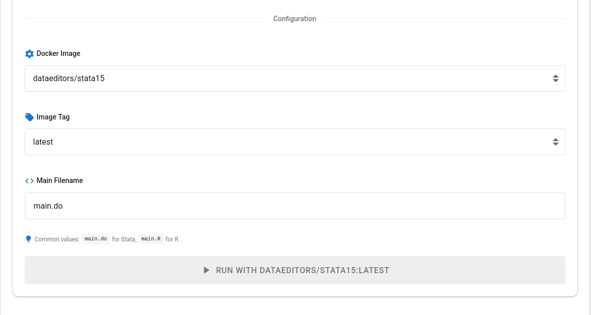
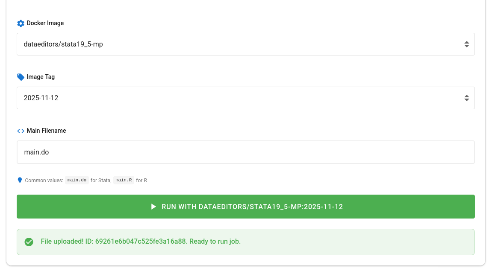
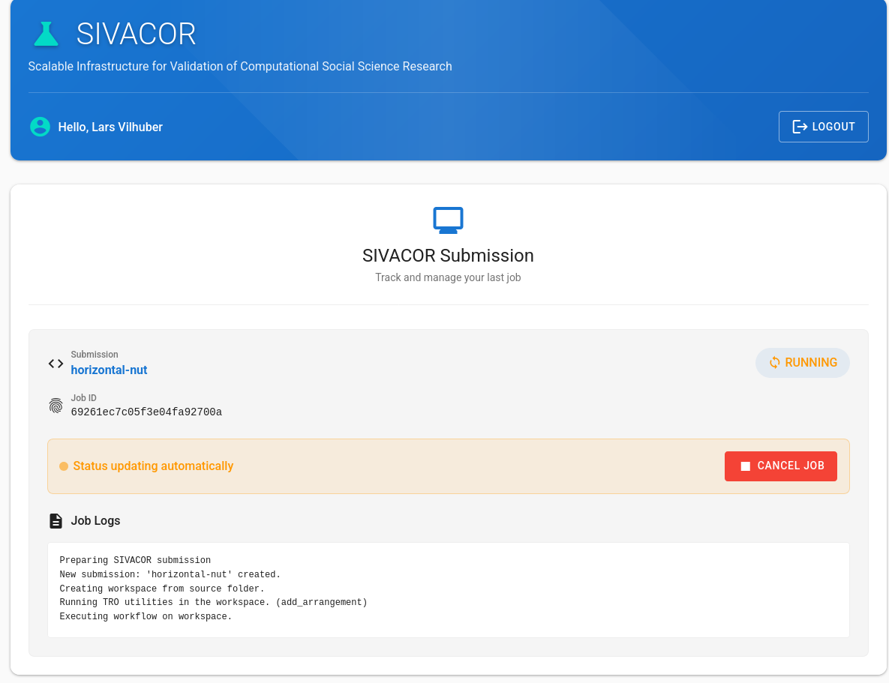

# User Guide

The main submission site is <https://submit.sivacor.org>.
## Logging In

SIVACOR uses institutional logins via [Globus](https://globus.org/) or [ORCID](https://orcid.org). 
You can choose one or the other.

::::{tabs-set}

:::{tab-item} ORCID Login

Click on the "Login with ORCID" button. You will be redirected to the ORCID login page. After entering your ORCID credentials, you will be redirected back to SIVACOR. You can also use your institutional login here, if known to ORCID.

:::

:::{tab-item} Globus Login

Click on the "Login with Globus" button. You can search for your institution, or use one of the other login methods. You will be redirected to your institution's login page. After entering your credentials, you will be redirected back to SIVACOR.

:::
::::

## Uploading a Package

Once logged in, you will see the upload page.

Upload the replication package (`ZIP` or `tar.gz` files). 

If the upload was successful, scroll down.

Choose first a Docker image from the curated list. Variuos `R` and `Stata` images are available. You can also select an image tag, but generally, the latest image should work. 

:::{info}

If you need a different image, please contact us.

:::

Finally, identify the name of the main file. This is the file that will be executed by SIVACOR. For `R`, this is typically an `R` script (`.R` file). For `Stata`, this is typically a `do` file (`.do` file). 

:::{warning}

Please be sure to use the proper case (`main.do` is not the same as `Main.do`) and include the extension.

:::

Then click on the `Run with...` button.

## Monitoring Job Status

:::{note}

You can only run one job at a time. If you have an ongoing job, you will not be able to submit a new one.

:::

Every time you come back to the page, you will see the status of your job.

## Downloading Results

Once the job is finished, you will see the following page:

You can now download the `Replicated Package`, a ZIP file that contains your originally submitted materials, the output files generated by your code, and the TRACE-related files (TRO Declaration, TRS Signature, Trusted Timestamp) that prove that this job was run on SIVACOR. 

::::{info}

You should provide the `Replicated Package` ZIP file to the journal where you are submitting your article.

:::{note}
For the AEA journals, you should "import" this ZIP file into the AEA's [Data and Code Repository](https://www.icpsr.umich.edu/sites/aea/home) (see [instructions](https://aeadataeditor.github.io/aea-de-guidance/)).

:::

::::

